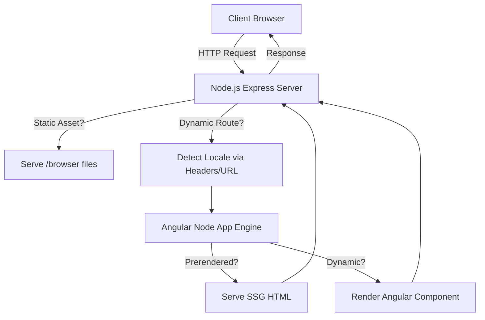
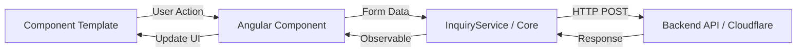
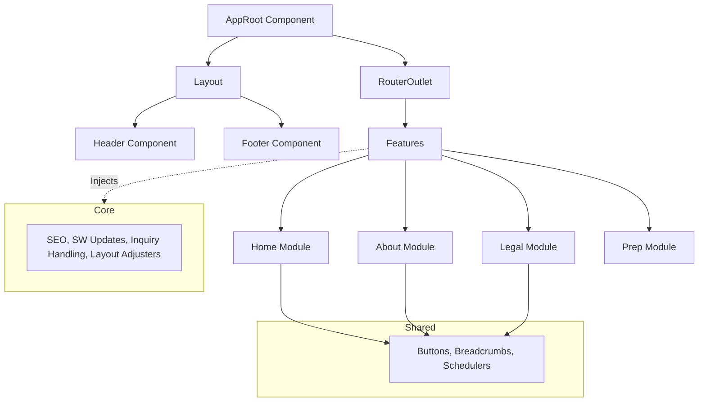

# Enterprise Angular 21 SSR Reference Architecture

> **A production-ready, highly optimized Angular architecture designed for scale, performance, and maintainability.**

This repository serves as a masterclass in modern Angular development. Engineered from the ground up by a Senior Angular Architect, it demonstrates how to architect a state-of-the-art (SOTA) frontend application using the absolute latest features of Angular 21. It is explicitly designed to serve as a technical reference for enterprise teams and prospective clients.

## 🚀 Why This Architecture is "Senior-Level"

Unlike typical frontend portfolios, this project treats the UI as a comprehensive, production-critical system:

- **Enterprise Feature-Driven Design:** The codebase strictly adheres to the `Core` / `Shared` / `Feature` / `Layout` module pattern. This eliminates circular dependencies, enforces a clean separation of concerns, and ensures the codebase remains maintainable as it scales.
- **Aggressive Performance Optimization:** Utilizes intelligent asset preloading, HTTP `Link` headers, intersection observers for lazy loading, and advanced `@defer` blocks. The result is a near-instant First Contentful Paint (FCP) and exceptional Core Web Vitals.
- **Node.js Express SSR & SSG Mastery:** Bypasses basic routing with a custom Express `server.ts` that handles dynamic `Accept-Language` locale detection, aggressive static asset caching (`Cache-Control`), security headers, and prerendering (SSG) for unparalleled SEO performance.
- **Production-Grade DevOps & Automation:** Features an automated GitHub Actions CI/CD pipeline, strict TypeScript compilation enforcement, and Husky git hooks. 
- **Modern UI/UX Standards:** Built with PrimeNG 21 (Aura theme) and PrimeFlex, demonstrating deep expertise in integrating complex, enterprise-grade UI libraries cleanly into a modern Angular context.
- **PWA & Offline Resilience:** Fully configured Service Worker with custom background update broadcasting (`sw-update-broadcast.service.ts`) for seamless, zero-downtime client updates.
- **Decoupled Data Architecture:** Implements a strict Service Layer pattern for all HTTP interactions. Components are kept "lean" and unaware of API implementation details, while `InquiryService` handles data mutation, error catching, and state persistence via RxJS Observables.


### System Architecture Flow



### Data Interaction Flow (Reactive Pattern)



### Component Structure



## Project Structure

```
src/
├── app/
│   ├── core/         # Singleton services (SEO, Updates, Inquiry, Adjustments)
│   ├── features/     # Feature modules (Home, About, Legal, etc.)
│   ├── layout/       # Global structural components (Header, Footer)
│   └── shared/       # Reusable UI components and utilities
├── assets/           # Static assets, fonts, icons
├── environments/     # Environment-specific configuration
└── locale/           # i18n translation files
```

## Getting Started

### Prerequisites

- Node.js (v24 or higher recommended)
- Angular CLI

### Installation

1. Clone the repository:
   ```bash
   git clone <your-repo-url>
   cd personal-website-opensource
   ```

2. Install dependencies:
   ```bash
   npm install
   ```

3. Configure Environment Variables:
   Update `src/environments/environment.ts` with your specific API and Worker URLs if you are connecting to a backend.

### Development Server

Run `npm run start` (or `ng serve`) for a dev server. Navigate to `http://localhost:4200/`. The application will automatically reload if you change any of the source files.

### Build

Run `npm run build:prod` to build the project for production. The build artifacts will be stored in the `dist/` directory. This utilizes Angular's static output mode for prerendering.

## License

This project is open-sourced under the MIT License.
